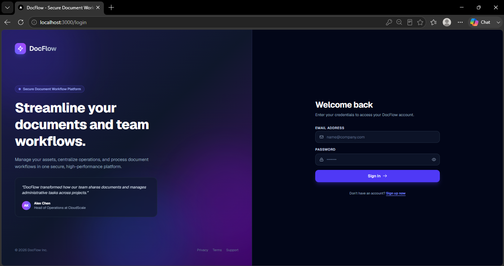
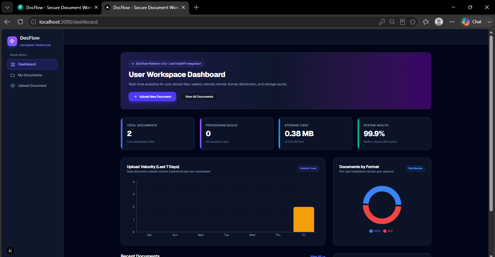
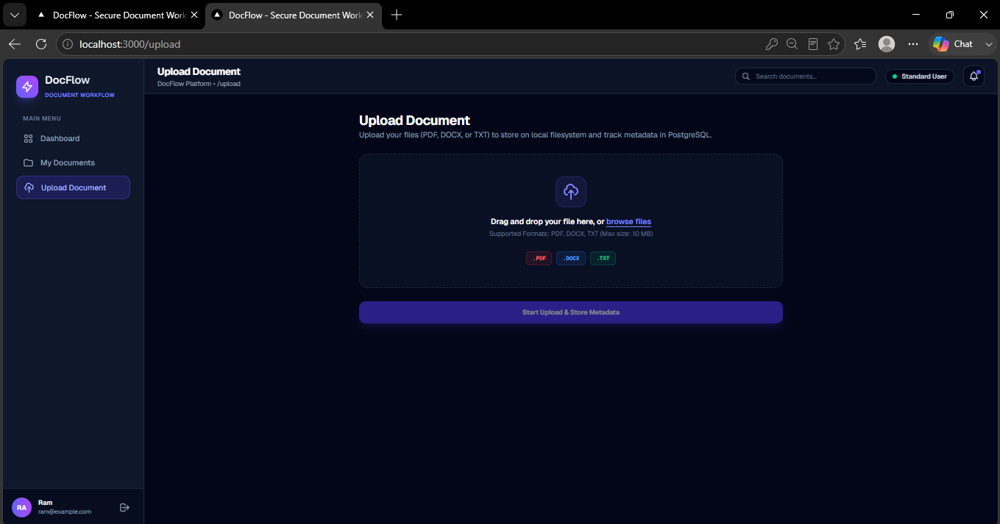
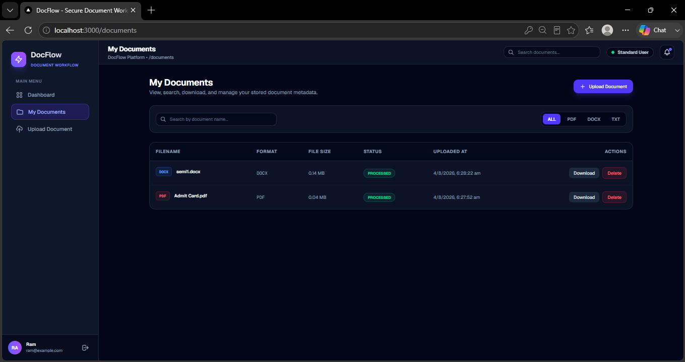
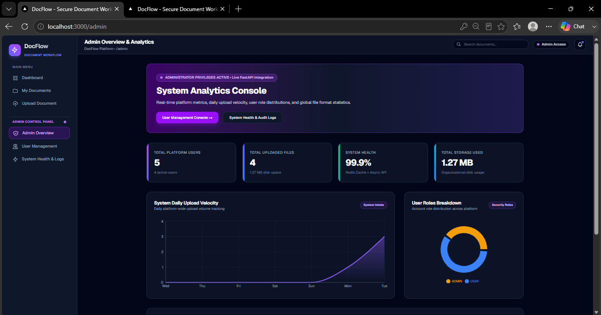
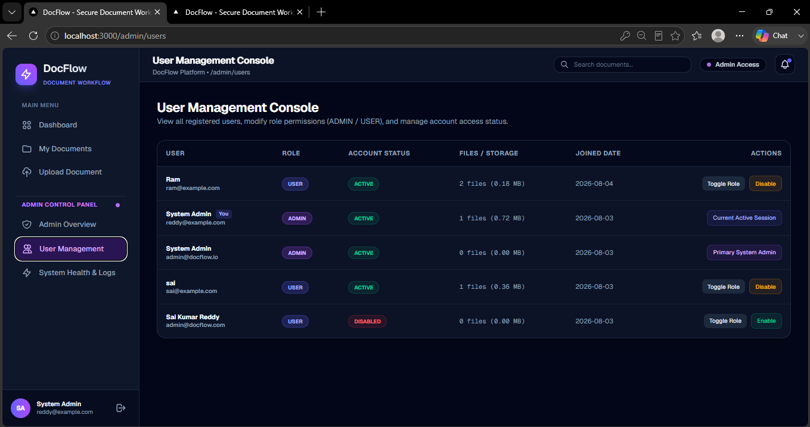
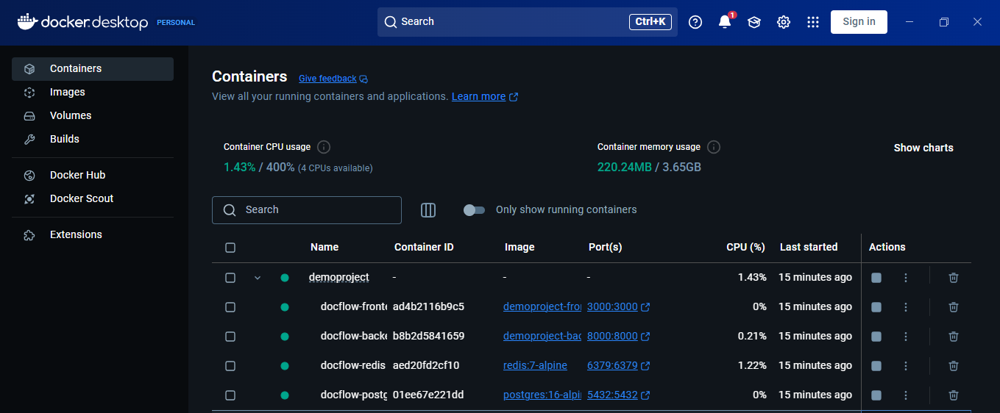

# DocFlow — Secure Document Workflow Platform

DocFlow is an enterprise-ready, production-grade Document Management & AI Workflow Platform built with Next.js 16 (App Router), FastAPI, PostgreSQL 16, Redis 7, and Docker.

---

## Application Screenshots & UI Showcase

| View / Page | Screenshot Preview |
| :--- | :--- |
| **Login Page** |  |
| **User Dashboard** |  |
| **Document Upload** |  |
| **Documents Page** |  |
| **Admin Dashboard** |  |
| **User Management** |  |
| **Docker Running** |  |

---

## Complete Project Documentation Index

Comprehensive documentation reflecting the **actual source code implementation** is available in the [`docs/`](docs/) directory:

| Document | Description |
| :--- | :--- |
| **[01. Project Overview](docs/01_Project_Overview.md)** | Executive summary, problem statement, features, tech stack justification, and project folder structure. |
| **[02. System Architecture](docs/02_System_Architecture.md)** | High-level system architecture, sequence diagrams (Auth, Upload, Cache), and component interactions. |
| **[03. Database Design](docs/03_Database_Design.md)** | ER Diagram, SQLAlchemy ORM models (`User`, `Document`, `ActivityLog`), indexes, and Alembic migrations. |
| **[04. API Documentation](docs/04_API_Documentation.md)** | Complete REST API specification for Authentication, Documents, Dashboard, Admin, and Health endpoints. |
| **[05. Backend Architecture](docs/05_Backend_Architecture.md)** | FastAPI architecture, dependency injection, services, Redis caching, rate limiting, and exception handling. |
| **[06. Frontend Architecture](docs/06_Frontend_Architecture.md)** | Next.js 16 App Router, Zustand state management, TanStack Query hooks, Recharts, and route guards. |
| **[07. Security Architecture](docs/07_Security.md)** | Argon2id hashing, HTTP-only JWT cookies, RBAC, UUID file masking, path traversal prevention, and rate limiting. |
| **[08. Docker Deployment](docs/08_Docker_Deployment.md)** | Dockerfiles, Docker Compose orchestration, network bridge, volume persistence, and deployment guide. |
| **[09. Testing & QA](docs/09_Testing.md)** | Automated python test suites (`test_phase3` through `test_phase6`), TypeScript verification, and health diagnostics. |
| **[10. Project Journey](docs/10_Project_Journey.md)** | Chronological history of Phase 0 through Phase 7, detailing objectives, challenges, and solutions. |

---

## Architecture & Tech Stack Summary

- **Frontend**: Next.js 16 (App Router), TypeScript, Tailwind CSS, TanStack Query v5, Recharts, Zustand.
- **Backend**: FastAPI, Async SQLAlchemy 2.0 (with AsyncPG), Pydantic v2, Alembic migrations.
- **Security**: Argon2id password hashing, PyJWT authentication, HTTP-only Cookies, Role-Based Access Control (`USER` / `ADMIN`).
- **Storage**: Local disk storage in `backend/uploads/` with UUID filename masking and MIME verification.
- **Caching & Rate Limiting**: Redis 7 async client with sliding-window rate limiting on `/login` and `/upload`.
- **Containerization**: Multi-container Docker Compose setup (`frontend`, `backend`, `postgres`, `redis`).

---

## Quick Start with Docker Compose

Run the entire multi-container stack with a single command:

```bash
# 1. Clean up any existing or stale Docker containers and volumes
docker compose down -v

# 2. Build and launch all 4 containers in background
docker compose up -d --build
```

### Container Endpoints & Ports

- **Frontend Application**: `http://localhost:3000`
- **FastAPI API & Swagger UI**: `http://localhost:8000/docs`
- **Health Diagnostic Endpoint**: `http://localhost:8000/health`
- **PostgreSQL Database**: `localhost:5432`
- **Redis Cache**: `localhost:6379`

---

## Creating & Managing Admin Users

For security hardening, the public registration page (`/signup`) **always creates accounts with the `USER` role** by default.

### Method 1: Using the Admin CLI Seed Script (Recommended)

Run the CLI utility script inside the running backend container:

```bash
# Create or promote default Admin account (admin@docflow.io / AdminPassword123!)
docker compose exec backend python seed_admin.py

# Or specify custom credentials:
docker compose exec backend python seed_admin.py myadmin@company.com MyPassword123! "System Admin"
```

### Method 2: Promoting via Admin UI Console
Once logged in as an Admin (`admin@docflow.io`), navigate to **User Management Console** (`http://localhost:3000/admin/users`) to promote any user account by clicking **Toggle Role**.

---

## Docker Command Cheat Sheet

```bash
# Start all containers in background
docker compose up -d

# Stop and remove containers and volumes
docker compose down -v

# View real-time service logs
docker compose logs -f

# Check Alembic migration status
docker compose exec backend alembic current

# Access Redis CLI ping
docker compose exec redis redis-cli ping
```

---

## Automatic Database Migrations

When the backend container starts, `entrypoint.sh` automatically executes:

```bash
alembic upgrade head
```

This applies all pending database migrations before launching Uvicorn, ensuring zero manual database setup is required.
