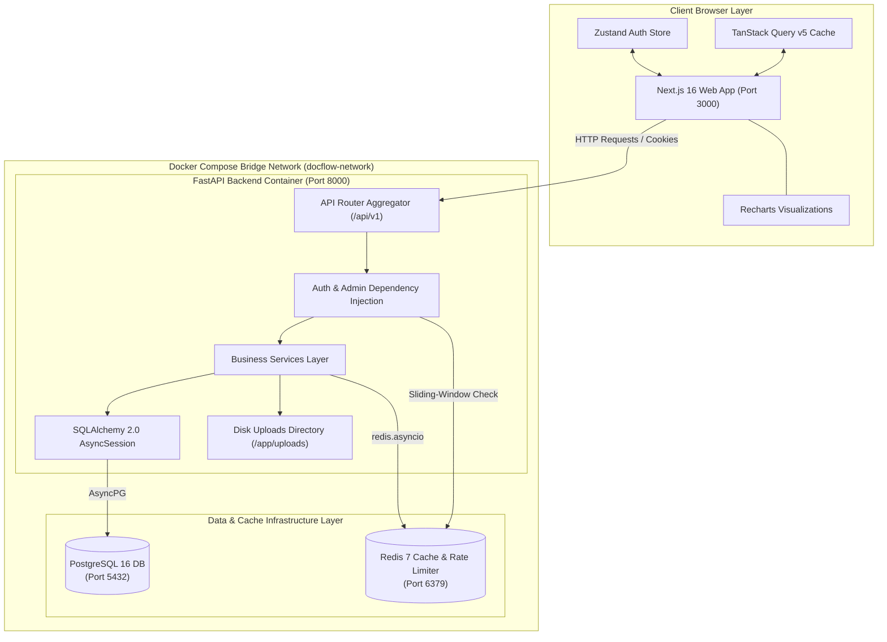
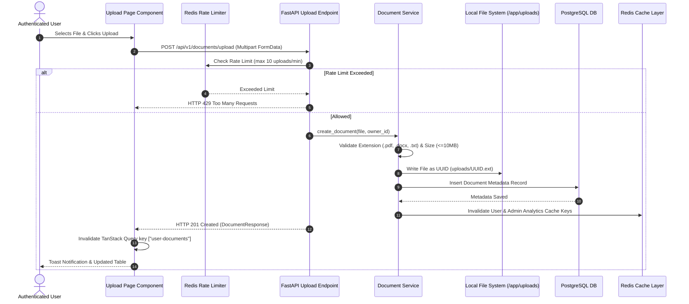

# 02 — System Architecture

## Overall System Architecture Diagram



---

## 1. Frontend Architecture (Next.js 16 App Router)

The frontend application is structured using Next.js 16 App Router, TypeScript, Tailwind CSS, TanStack Query v5, and Zustand.

### Key Architectural Layers
1. **Route Groups & Protection**:
   - `app/(auth)`: Public authentication routes (`/login`, `/signup`).
   - `app/(dashboard)`: Authenticated layout wrapped with session verification. Executes `checkAuth()` on mount.
   - `app/(dashboard)/admin/*`: Role-restricted pages guarded by `user.role === 'ADMIN'` check.
2. **Global State Management (Zustand)**:
   - `useAuthStore`: Manages user profile (`UserResponse | null`), authentication status, loading states, and auth actions (`login`, `signup`, `logout`, `checkAuth`).
3. **Data Fetching & Cache Invalidation (TanStack Query v5)**:
   - Custom React hooks in `hooks/use-dashboard.ts` manage server queries (`useUserDocuments`, `useUserDashboardStats`, `useAdminAnalytics`, `useAdminUsers`, `useActivityLogs`) and mutations (`useDeleteDocument`, `useToggleUserStatus`, `useUpdateUserRole`).
   - Invalidates query keys (`["user-documents"]`, `["admin-analytics"]`, `["admin-users"]`) automatically upon successful mutations.
4. **API Client (`lib/api-client.ts`)**:
   - Centralized wrapper over native `fetch` API configured with `credentials: "include"`, ensuring HTTP-only `access_token` cookies are transmitted automatically on cross-origin calls.

---

## 2. Backend Architecture (FastAPI & SQLAlchemy 2.0)

The backend service is built with FastAPI, using asynchronous non-blocking I/O and Pydantic v2 schemas.

```text
 ┌────────────────┐      Request       ┌────────────────┐      Validate      ┌────────────────┐
 │ Client Request │ ─────────────────► │ FastAPI Router │ ─────────────────► │ Pydantic Schema│
 └────────────────┘                    └───────┬────────┘                    └───────┬────────┘
                                               │                                     │
                                               │ Inject Dependencies                 │ Validated Input
                                               ▼                                     ▼
 ┌────────────────┐      Execute       ┌────────────────┐     ORM Query      ┌────────────────┐
 │ PostgreSQL DB  │ ◄───────────────── │ Service Layer  │ ◄───────────────── │ Dependency (DB)│
 └────────────────┘                    └────────────────┘                    └────────────────┘
```

### Modular Directory Breakdown
- **`app/api/deps.py`**: Provides reusable dependency functions:
  - `get_db()`: Yields async SQLAlchemy database session (`AsyncSession`).
  - `get_current_active_user()`: Decodes JWT cookie/token, verifies user existence and active status.
  - `require_admin()`: Wraps `get_current_active_user()` and enforces `user.role == 'ADMIN'` (raises 403 if unauthorized).
- **`app/services/`**: Business logic decoupled from endpoint handlers:
  - `auth_service.py`: Authentication, registration, JWT creation, password hashing.
  - `document_service.py`: Storage validation, UUID filename generation, file deletion.
  - `analytics_service.py`: Aggregates storage metrics, 7-day trends, file distribution using SQLAlchemy async queries.
  - `cache_service.py`: Encapsulates Redis get/set/delete operations and cache key construction.

---

## 3. Authentication & Authorization Sequence Diagram

```mermaid
sequenceDiagram
    autonumber
    actor User as User Browser
    participant FE as Next.js (App Router)
    participant API as FastAPI Backend
    participant Auth as Auth Service
    participant DB as PostgreSQL DB
    participant Cookie as HTTP-only Cookie Store

    User->>FE: Submits Login Form (email, password)
    FE->>API: POST /api/v1/auth/login
    API->>Auth: authenticate_user(email, password)
    Auth->>DB: Query User by Email
    DB-->>Auth: User ORM Record
    Auth->>Auth: Verify Argon2id Password Hash
    alt Invalid Credentials
        Auth-->>API: Authentication Error
        API-->>FE: HTTP 401 Unauthorized
    else Valid Credentials
        Auth->>Auth: Generate PyJWT Access Token (HS256)
        API->>Cookie: Set-Cookie: access_token=JWT; HttpOnly; SameSite=Lax
        API-->>FE: HTTP 200 OK { access_token, token_type }
        FE->>FE: Update Zustand useAuthStore state
        FE-->>User: Redirect to /dashboard or /admin
    end
```

---

## 4. Document Upload Sequence Diagram



---

## 5. Redis Cache & Data Flow Architecture

```text
                               ┌────────────────────────┐
                               │  GET Document / Stats  │
                               └───────────┬────────────┘
                                           │
                                           ▼
                               ┌────────────────────────┐
                               │ Check Redis Cache Key  │
                               └───────────┬────────────┘
                                           │
                        ┌──────────────────┴──────────────────┐
                        │                                     │
                 Cache Hit (JSON)                      Cache Miss / Error
                        │                                     │
                        ▼                                     ▼
             ┌─────────────────────┐               ┌─────────────────────┐
             │ Return Cached JSON  │               │ Query PostgreSQL DB │
             └─────────────────────┘               └──────────┬──────────┘
                                                              │
                                                              ▼
                                                   ┌─────────────────────┐
                                                   │ Write Result to     │
                                                   │ Redis (TTL 300s)    │
                                                   └──────────┬──────────┘
                                                              │
                                                              ▼
                                                   ┌─────────────────────┐
                                                   │ Return Fresh Data   │
                                                   └─────────────────────┘
```

---

## 6. Docker Container Orchestration Architecture

DocFlow is containerized into four independent services linked on a isolated bridge network (`docflow-network`):

```text
 ┌───────────────────────────────────────────────────────────────────────────────────────────────────┐
 │                                   Docker Bridge: docflow-network                                  │
 │                                                                                                   │
 │   ┌───────────────────────┐                  HTTP                  ┌──────────────────────────┐   │
 │   │   docflow-frontend    │ ──────────────────────────────────────►│     docflow-backend      │   │
 │   │   (Node 20 Alpine)    │                                        │     (Python 3.11 Slim)   │   │
 │   │   Port: 3000          │                                        │     Port: 8000           │   │
 │   └───────────────────────┘                                        └────────────┬─────────────┘   │
 │                                                                                 │                 │
 │                                             ┌───────────────────────────────────┴─────────────┐   │
 │                                             │                                                 │   │
 │                                             ▼                                                 ▼   │
 │                                ┌──────────────────────────┐                      ┌──────────────────────────┐
 │                                │     docflow-postgres     │                      │      docflow-redis       │
 │                                │    (PostgreSQL 16)       │                      │       (Redis 7)          │
 │                                │    Port: 5432            │                      │       Port: 6379         │
 │                                └────────────┬─────────────┘                      └────────────┬─────────────┘
 │                                             │                                                 │
 └─────────────────────────────────────────────┼─────────────────────────────────────────────────┼───┘
                                               ▼                                                 ▼
                                    ┌────────────────────┐                            ┌────────────────────┐
                                    │  postgres_data     │                            │   redis_data       │
                                    │  (Docker Volume)   │                            │  (Docker Volume)   │
                                    └────────────────────┘                            └────────────────────┘
```

### Service Health Dependencies
1. **`docflow-postgres`**: Health check runs `pg_isready -U postgres -d docflow_db`.
2. **`docflow-redis`**: Health check runs `redis-cli ping`.
3. **`docflow-backend`**: Waits for `postgres` and `redis` to reach `healthy` state. Executes `entrypoint.sh` (`alembic upgrade head`) before starting Uvicorn server on port `8000`. Health check runs `curl -f http://localhost:8000/health`.
4. **`docflow-frontend`**: Waits for `backend` to reach `healthy` state. Runs Next.js production server on port `3000`.
